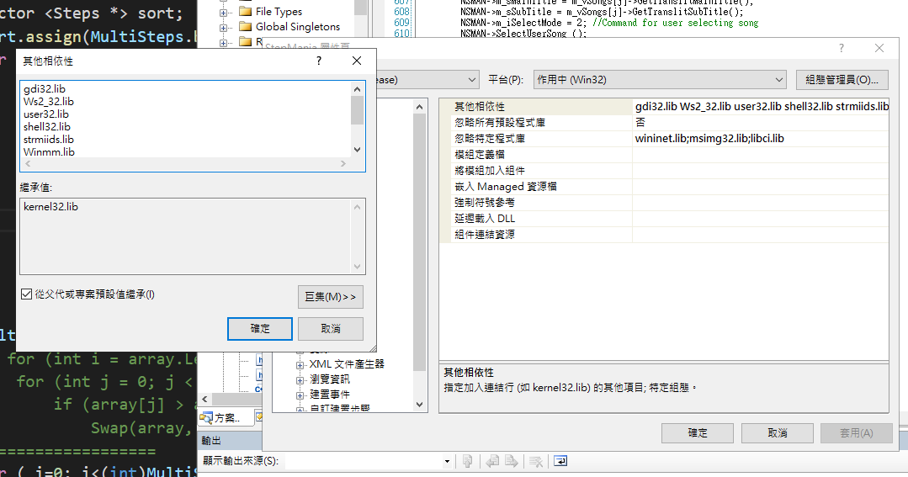
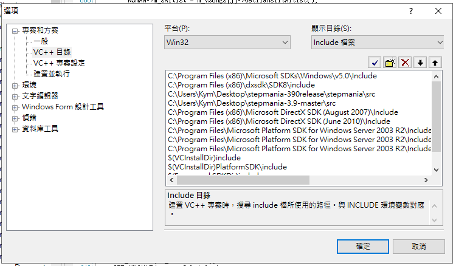
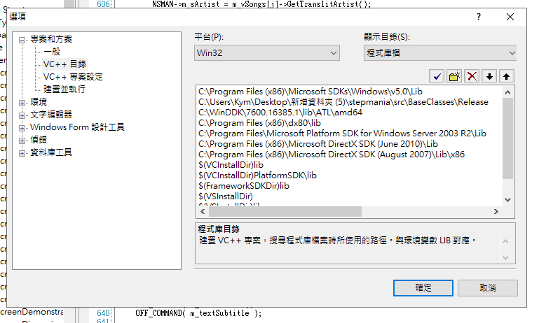
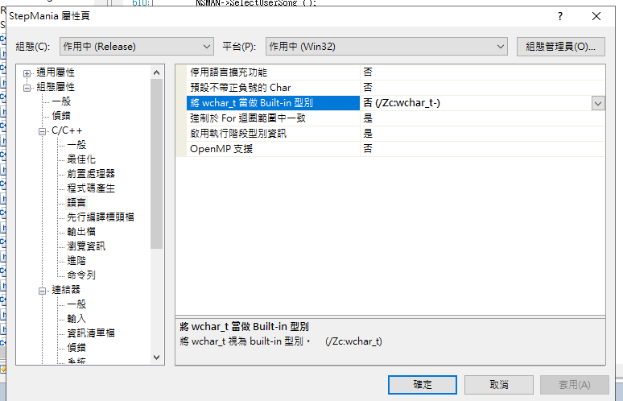

fork from [stepmania](https://github.com/stepmania/stepmania)

# Function modification 功能
+ Resolved player rename errors
+ Solve the problem that cs6 connection mode cannot display the name
+ Solve the problem of song group jummping to [ALL SONGS] in connection mode
+ Solve the difficulty of ordering songs in connection mode
+ Add homeowner replacement usage: /host player_name

+ 解決玩家重新命名錯誤
+ 解決cs6連線模式無法顯示名稱問題
+ 解決連線模式歌包跳動問題
+ 解決連線模式歌曲難度排序問題
+ 加入更換房主功能 用法: /host 玩家名稱

# StepMania 3.9 compile
+ windows10
+ Visual Studio 2005
+ [dxsdk + Microsoft Platform SDK + Microsoft SDKs](https://drive.google.com/open?id=17gCXiIvhJP_w4druciA0DQPqaPKpw6cX)
	- 其他相依性  
	gdi32.lib  
	Ws2_32.lib  
	user32.lib  
	shell32.lib  
	strmiids.lib  
	Winmm.lib  
	strmbase.lib  
	d3dx8.lib 
	
  
  
  
  

# Compile Problem
+ error LNK2005: _jpeg_read_scanlines already defined in D3dx8.lib(
jdapistd.obj)[link](https://sourceforge.net/p/stepmania/mailman/message/11726793/)
  - difficulty d3dx8.lib[link](https://realmike.org/blog/projects/directx-8-borland-libs-download-page/)

# Reference
+ [stepmania v390release](https://github.com/stepmania/stepmania/releases/tag/v390release)
+ [How to Make Stepmania 3.9 Compile in Visual C++ 2005 Express Edition](https://cspotcode.wordpress.com/how-to-make-stepmania-39-compile-in-visual-c-2005-express-edition/)
+ [What do I need to compile v.3.9+R?](https://www.reddit.com/r/Stepmania/comments/58hv1x/what_do_i_need_to_compile_v39r/)
